# 3D Print Files

This folder contains custom 3D print files for the Nematostella imaging setup.

> **Recommended filament:** PLA basic or matte black PLA —
> [Bambu Lab PLA Matte](https://eu.store.bambulab.com/de/products/pla-matte?variant=593612471288803347)

## External Links

| Component | Source |
|-----------|--------|
| ESP32 Case | [Thingiverse – thing:4667813](https://www.thingiverse.com/thing:4667813) |
| Wago Case | [Makerworld](https://makerworld.com/de/models/555698-wago-221-3x3-junctionbox?from=search#profileId-474467) |

## Parts

PNG previews are auto-generated by CI from the STL files in [`STL/`](STL/).

| Preview | File | Description |
|---------|------|-------------|
| 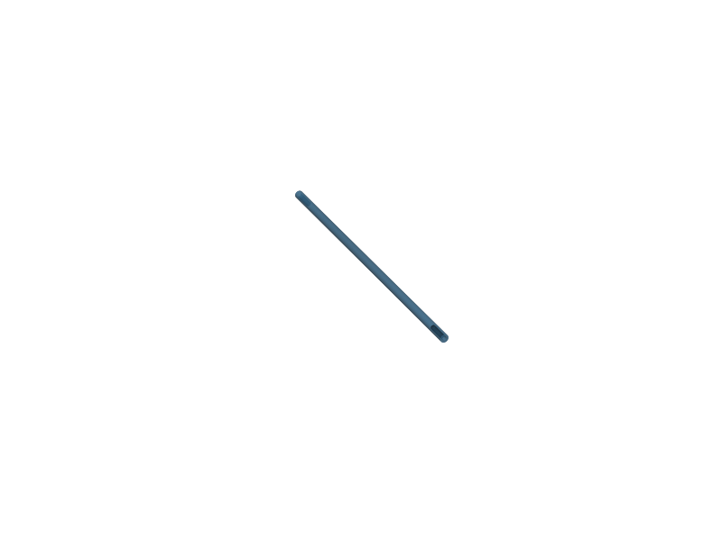 | [`Achse_10mm.stl`](STL/Achse_10mm.stl) | Axis component (10 mm) |
|  | [`Cam_Mount.stl`](STL/Cam_Mount.stl) | Camera mount (1) |
| 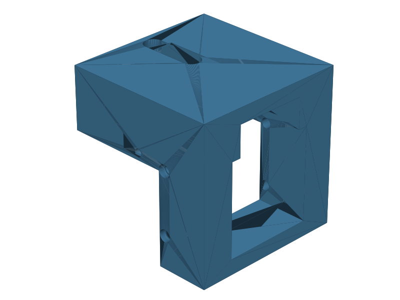 | [`Cam_Mount_2.stl`](STL/Cam_Mount_2.stl) | Camera mount (2) |
| 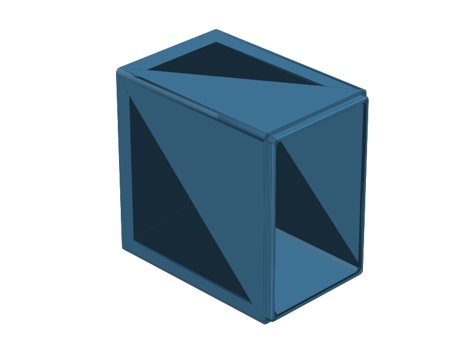 | [`Extension_neu.stl`](STL/Extension_neu.stl) | Rail extension |
| 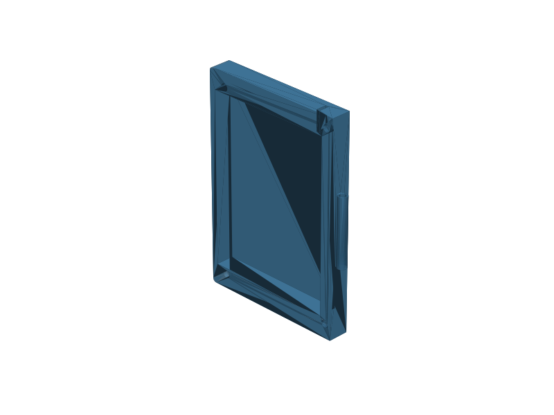 | [`Lid_Mount_Darkfieldillumination_with_guide.stl`](STL/Lid_Mount_Darkfieldillumination_with_guide.stl) | Lid mount for dark-field illumination, with alignment guide |
| 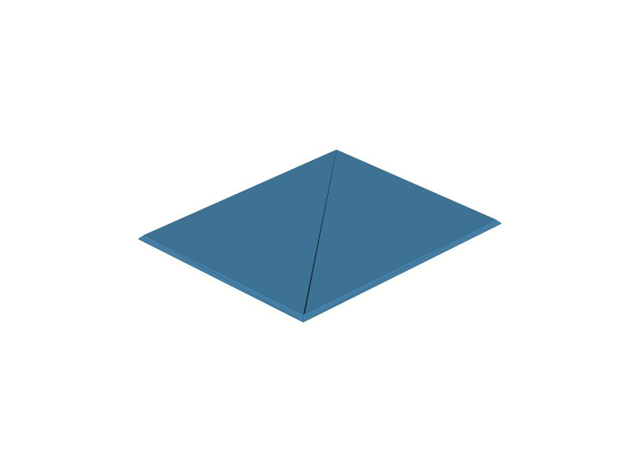 | [`Mirror_cutting_template.stl`](STL/Mirror_cutting_template.stl) | Mirror cutting template |
| 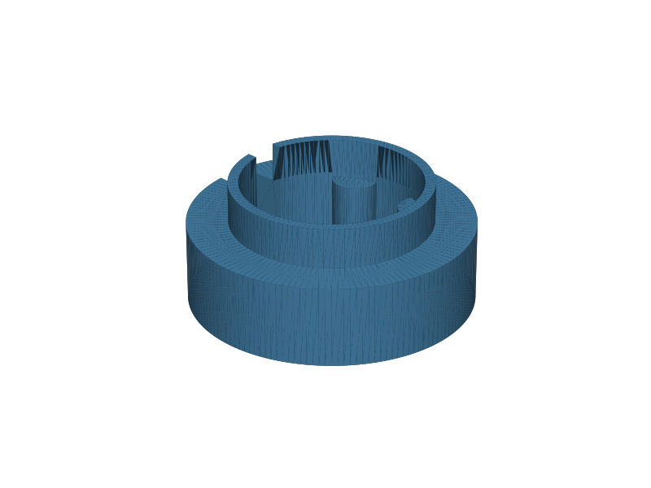 | [`Mosfet_cable.stl`](STL/Mosfet_cable.stl) | MOSFET cable holder |
| 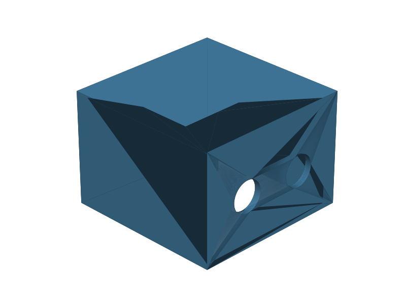 | [`Mosfet_case.stl`](STL/Mosfet_case.stl) | MOSFET case |
| 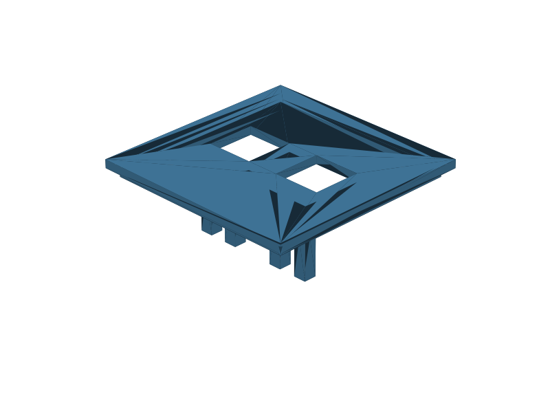 | [`Mosfet_case_lid.stl`](STL/Mosfet_case_lid.stl) | MOSFET case lid |
| 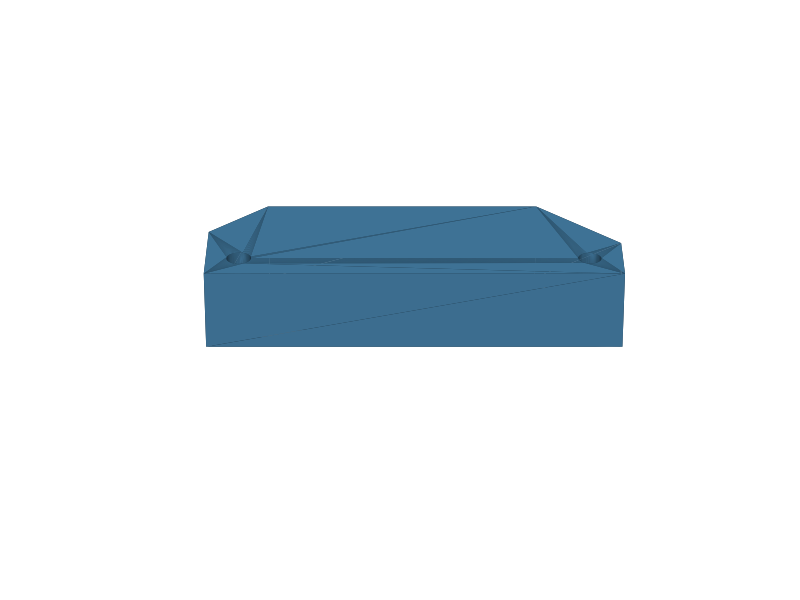 | [`NematostellaImager_mirrormount.stl`](STL/NematostellaImager_mirrormount.stl) | Mirror mount for imager |
| 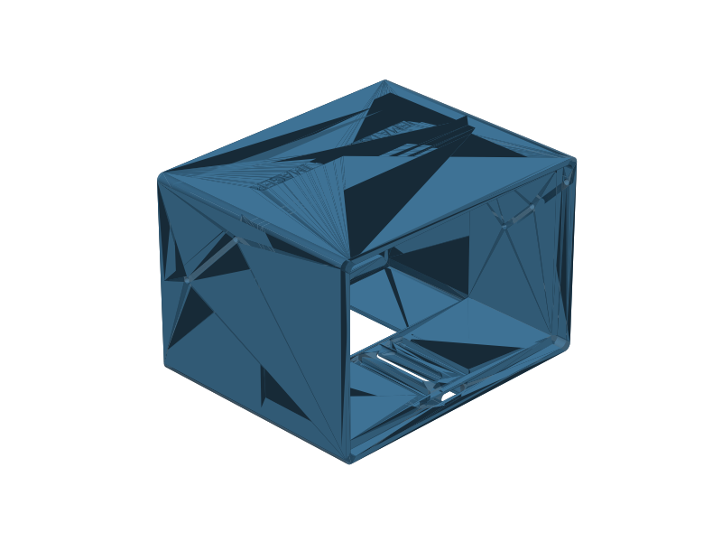 | [`NematostellaImager_v0.stl`](STL/NematostellaImager_v0.stl) | Imager body (v0) |
| 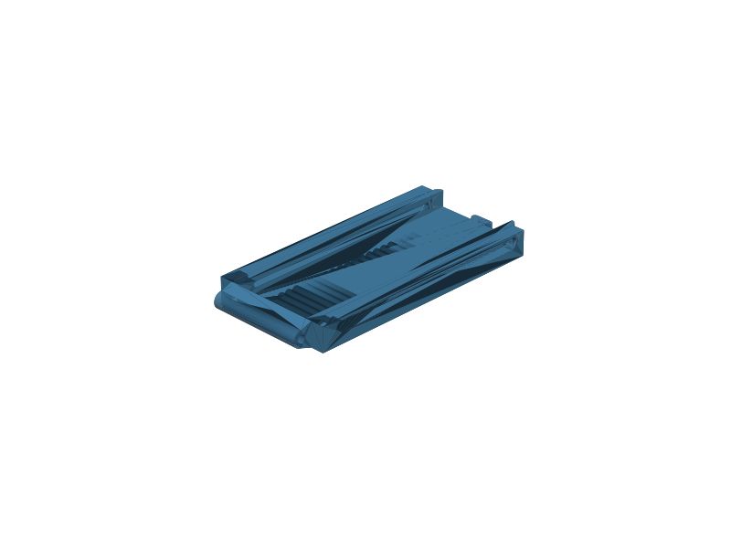 | [`Puzzleteil_rail_extension_circle_lock.stl`](STL/Puzzleteil_rail_extension_circle_lock.stl) | Rail extension with circle lock |
| 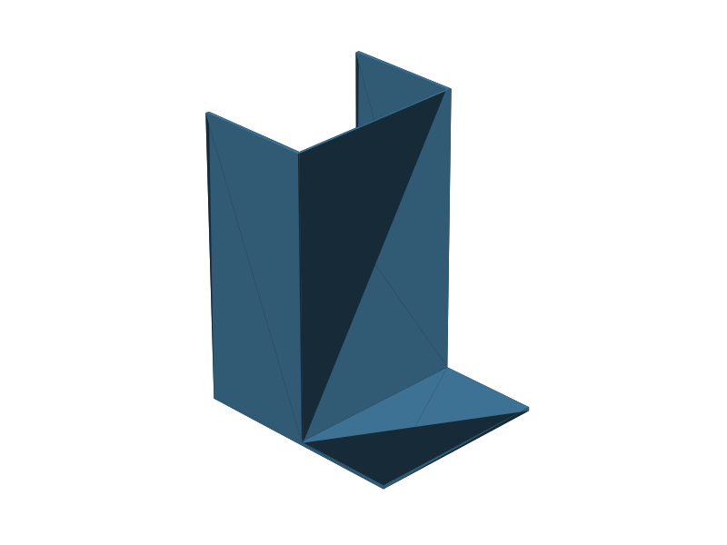 | [`Streulichtschutz.stl`](STL/Streulichtschutz.stl) | Stray-light shield |
| 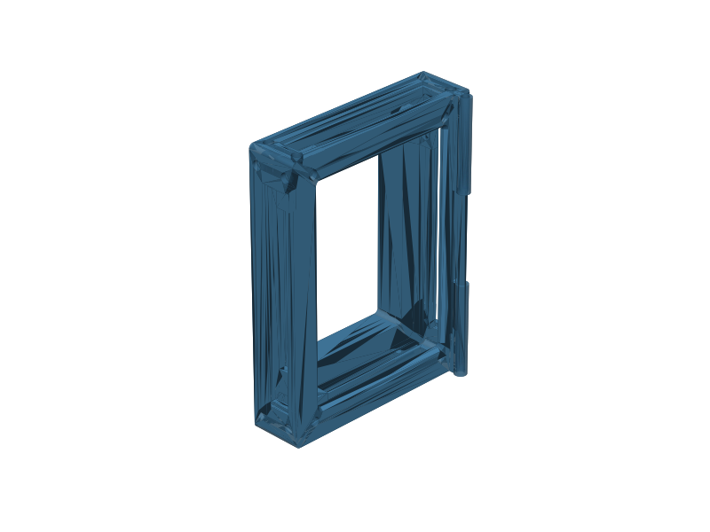 | [`Wellplate_Mount_Darkfieldillumination_rail_kopie.stl`](STL/Wellplate_Mount_Darkfieldillumination_rail_kopie.stl) | Well-plate mount for dark-field illumination — print vertical with supports painted to the inside |
| 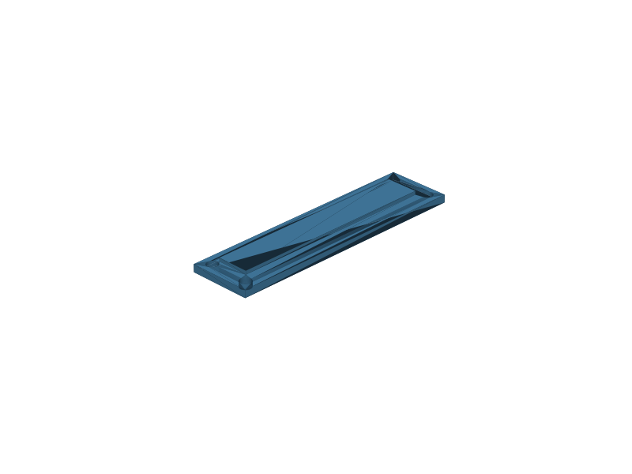 | [`blenden_kurz_links.stl`](STL/blenden_kurz_links.stl) | Short aperture (left) |
| 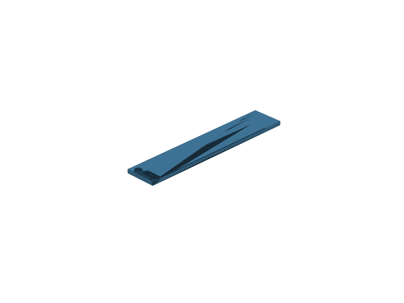 | [`blenden_lang.stl`](STL/blenden_lang.stl) | Long aperture |
| 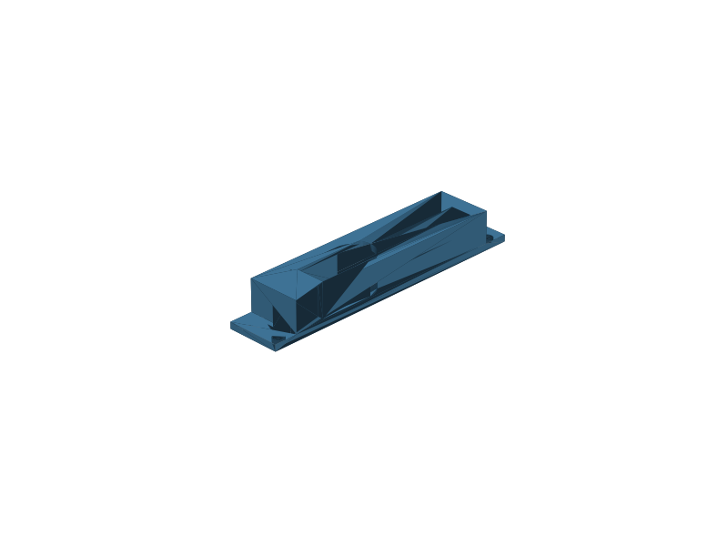 | [`blenden_lang_dht22.stl`](STL/blenden_lang_dht22.stl) | Long aperture with DHT22 cutout |
