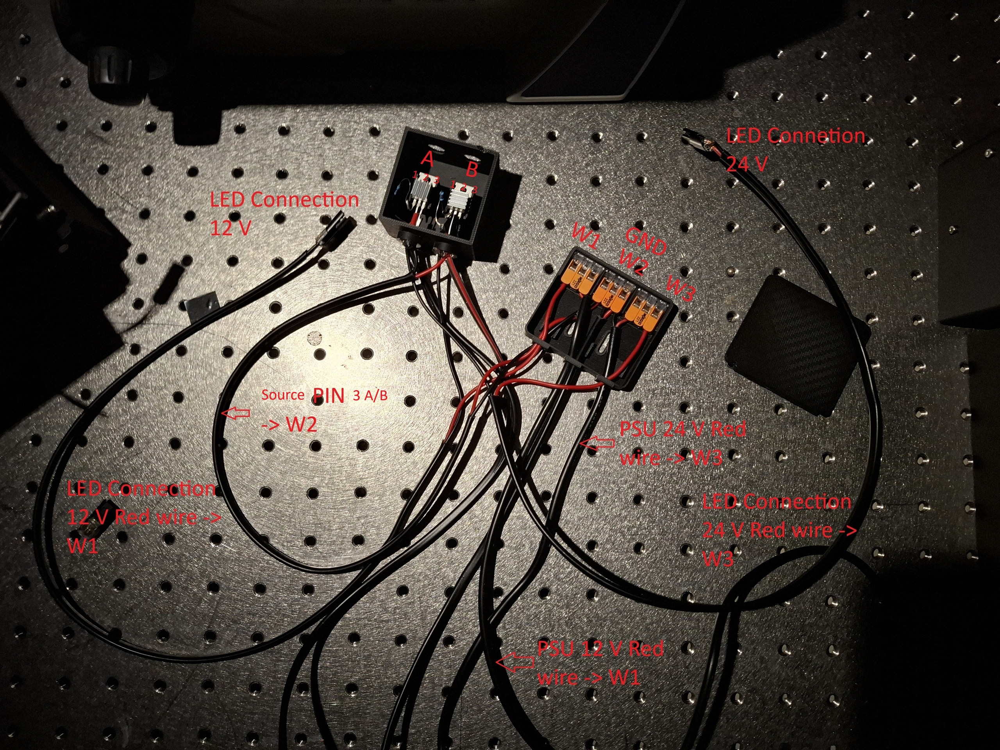

# Hardware & Assembly

The recording system is built around an **ESP32-DevKitC** microcontroller that
drives two LED channels (IR + White) via logic-level MOSFETs and reads a DHT22
environmental sensor. This is the **standard, recommended setup**.

!!! tip "Full step-by-step assembly guide"
    This page is a quick wiring & pinout reference. The complete assembly
    instructions (with build photos) are maintained in the
    [**project README on GitHub**](https://github.com/s1alknau/Nematostella-time-series#hardware-setup--assembly).

!!! info "Alternative board"
    An [ESP32-S3-BOX-3 (Alternative)](ESP32-S3-BOX-3_CONFIGURATION.md) with an
    integrated touchscreen is also supported. It uses different GPIO pins but the
    same firmware (auto-detected). Use it only if you need the display — for most
    users the ESP32 DevKit below is the simpler choice.


## Required components

Full parts list with ordering links (example vendors — equivalents work too).

### 1. ESP32 microcontroller

**Option A — ESP32-DevKitC (standard, recommended)**

- Custom firmware with LED control and sensor support (v2.2 or higher)
- GPIO pins: GPIO 4 (IR LED), GPIO 15 (White LED), GPIO 14 (DHT22)
- Order: [AZDelivery ESP32 DevKitC (Amazon)](https://www.amazon.de/AZDelivery-Development-Anschluss-kompatibel-inklusive/dp/B0D8WDDGC3/ref=asc_df_B0D8WDDGC3?tag=bingshoppin0b-21&linkCode=df0&hvadid=80814312995674&hvnetw=o&hvqmt=e&hvbmt=be&hvdev=c&hvlocint=&hvlocphy=129578&hvtargid=pla-4584413787761197&msclkid=d051c43db7391f3541afae31cde17710&th=1)

**Option B — [ESP32-S3-BOX-3 (Alternative)](ESP32-S3-BOX-3_CONFIGURATION.md)**

- Board with integrated 2.4" touchscreen; requires the ESP32-S3-BOX-3-DOCK for GPIO access
- GPIO pins: GPIO 10 (IR LED), GPIO 11 (White LED), GPIO 12 (DHT22)
- See the [ESP32-S3-BOX-3 configuration guide](ESP32-S3-BOX-3_CONFIGURATION.md)

### 2. LED system

- **IR LED** — 850 nm, **12 V** (e.g. LED Streifen 2538 120 LED/m IR 850 nm): [buyledstrip.com](https://www.buyledstrip.com/de/led-streifen-2538-120-led-m-ir-850nm-je-50cm.html)
- **White LED** — broad-spectrum, **24 V** (e.g. 24 V COB 320 L/m iNextStation): [Amazon](https://www.amazon.de/dp/B0CT3B7K1D?ref_=ppx_hzsearch_conn_dt_b_fed_asin_title_1&th=1)

!!! warning "Different LED voltages"
    IR and White LEDs run on **different voltages (12 V vs. 24 V)** — use two
    separate PSUs and never cross the rails.

### 3. DHT22 sensor

- Temperature −40…80 °C (±0.5 °C), humidity 0–100 % RH (±2–5 %)
- Board with integrated pull-up resistor (no external resistor needed)
- Order: [DHT22 sensor board (Amazon)](https://www.amazon.de/dp/B0F42HN92Q?ref=ppx_yo2ov_dt_b_fed_asin_title)

### 4. Power supplies & MOSFETs (logic-level, 3.3 V)

- **ESP32 power**: 5 V via USB (from the computer)
- **IR LED power**: 12 V DC, 2–5 A: [buyledstrip.com](https://www.buyledstrip.com/de/netzteil-60-watt-12v-24v.html?id=173564582)
- **White LED power**: 24 V DC, 2–5 A: [buyledstrip.com](https://www.buyledstrip.com/de/netzteil-60-watt-12v-24v.html?id=173564582)
- **BOJACK IRLZ34N MOSFET** 30 A / 55 V (IRLZ34NPBF): [Amazon](https://www.amazon.de/dp/B0893WBH6H?ref=ppx_yo2ov_dt_b_fed_asin_title)

!!! danger "Common ground required"
    A common ground between USB/ESP32 ground and **both** PSU grounds is
    mandatory.

### 5. Connectors, wiring, screw kit

- **3× WAGO 221-413** COMPACT lever connectors (3-conductor): [Amazon](https://www.amazon.de/dp/B0CDPC692C?ref=ppx_yo2ov_dt_b_fed_asin_title)
- PSU connector DC plug: [buyledstrip.com](https://www.buyledstrip.com/de/55-mm-dc-buchse-weiblich.html)
- 220 Ω resistor (gate series resistor): [Elegoo resistor kit (Amazon)](https://www.amazon.de/Elegoo-Widerst%C3%A4nde-Sortiment-St%C3%BCck-Metallfilm/dp/B072BHDBDG/ref=asc_df_B072BHDBDG?tag=bingshoppin0b-21&linkCode=df0&hvadid=80814312989902&hvnetw=o&hvqmt=e&hvbmt=be&hvdev=c&hvlocint=&hvlocphy=192097&hvtargid=pla-4584413786304525&psc=1&msclkid=bc9a95dd8148109d2d6dffdc21218251)
- Magnets: [Amazon](https://www.amazon.de/dp/B0C84SYYRC?ref=ppx_yo2ov_dt_b_fed_asin_title&th=1)
- White-light LED connector: [Amazon](https://www.amazon.de/dp/B0BJKC6WQJ?ref=ppx_yo2ov_dt_b_fed_asin_title)
- Wires and connectors: [Amazon](https://www.amazon.de/dp/B0B67KW6BC/ref=sspa_dk_detail_5?psc=1&pd_rd_i=B0B67KW6BC&pd_rd_w=Egnt7&content-id=amzn1.sym.99a46b10-6bb0-41eb-aa22-b26ae1e31690&pf_rd_p=99a46b10-6bb0-41eb-aa22-b26ae1e31690&pf_rd_r=B64Y7SJKH0MZRHKKB5XT&pd_rd_wg=B3gIN&pd_rd_r=712c8eed-6bdc-40b7-bd24-77516c8be8b2&aref=HdgOtKuxpu&sp_csd=d2lkZ2V0TmFtZT1zcF9kZXRhaWxfdGhlbWF0aWM)
- Glue: [Amazon](https://www.amazon.de/dp/B0C6R9G4ZW?ref=nb_sb_ss_w_as-reorder_k0_1_8&crid=120N5DRLM9J5Q&sprefix=sekunden&th=1)
- Hot glue gun: [Amazon](https://www.amazon.de/RUNSAI-Hei%C3%9Fklebepistole-Klebepistole-Heissklebepistole-Klebepistolen/dp/B0FDGNZRPR)
- Screw kit incl. hex keys: [Amazon](https://www.amazon.de/dp/B0CZSW8S66)

### 6. Camera

- **Hik Robotics MV-CS-013 60GN** (near-infrared) — request via the UC2 company
  ([imprint](https://openuc2.com/imprint/)) or
  [annolution shop](https://www.annolution.com/shop/hikrobotarea-scan-camera-1-3mp-area-scan-camera-gige-nir-8254)
- Product page: [hikrobotics.com](https://www.hikrobotics.com/en/machinevision/productdetail/?id=7038)

### 7. 3D-printed parts

- See [3D-Printed Parts](3D_Druck/README.md) for all STL/STEP files and print settings.

## Pin reference — ESP32 DevKit

```
GPIO 4  → IR LED MOSFET gate    (PWM, 15 kHz)
GPIO 15 → White LED MOSFET gate (PWM, 15 kHz)
GPIO 14 → DHT22 data            (with 10 kΩ pull-up)
3.3V    → DHT22 VCC
GND     → DHT22 GND, common ground hub (WAGO #W2)
```

## LED system assembly (IRLZ34N MOSFETs)

Each LED channel is switched by one logic-level **IRLZ34N** MOSFET driven
directly from an ESP32 GPIO — no gate driver needed.

**MOSFET specifications**

- Model: BOJACK IRLZ34N (IRLZ34NPBF)
- Type: N-channel logic-level MOSFET
- Maximum ratings: 30 A, 55 V
- Gate threshold: 1–2 V (logic-level, works with 3.3 V from the ESP32)
- Package: TO-220

{ loading=lazy }

*Assembled LED driver stage — dual IRLZ34N MOSFETs with WAGO connectors.*

**MOSFET connection details**

1. **Gate** → ESP32 GPIO (4 or 15) via a 220 Ω resistor
2. **Drain** → LED connection (−) [12 V for IR, 24 V for White]
3. **Source** → common ground (WAGO **#W2**)
4. **LED connections:**
    - IR LED: (+) from 12 V PSU via WAGO **#W1**
    - White LED: (+) from 24 V PSU via WAGO **#W3**
5. **DHT22:**
    - GND → common ground W2 (or best: directly to ESP32 GND)
    - VCC → 3.3 V at the ESP32
    - Data → GPIO 14

```
IRLZ34N  (IR LED):                 IRLZ34N  (White LED):
  Gate   → ESP32 GPIO 4   (220 Ω)    Gate   → ESP32 GPIO 15  (220 Ω)
  Drain  → IR LED (−) / 12 V loop    Drain  → White LED (−) / 24 V loop
  Source → common ground (W2)        Source → common ground (W2)
```

**Good to know**

- IRLZ34N is logic-level compatible (works with a 3.3 V gate voltage).
- No additional driver circuit is needed between ESP32 and MOSFET.
- PWM frequency: 15 kHz (set in firmware).
- Handles high-power LED strips (up to 30 A theoretical; typically 1–3 A).

!!! warning "Safety notes"
    - :material-eye-off: IR LEDs are **invisible** — use an IR viewer card to verify operation.
    - Add a heatsink on the MOSFET if driving >2 A continuous (usually not the case).
    - Add a flyback diode (1N4007) across the LED if using inductive loads.
    - Ensure a **common ground** between ESP32, PSUs, and MOSFETs.
    - Use appropriately gauged wire for the current loads.

## Power distribution (WAGO)

```
WAGO #W1: 12 V+          → IR LED (+)
WAGO #W3: 24 V+          → White LED (+)
WAGO #W2: common ground  (CRITICAL!)
          ├─ 12 V PSU GND
          ├─ 24 V PSU GND
          ├─ ESP32 GND
          ├─ both MOSFET sources
          └─ both LED cathodes (−)
```

!!! danger "Common ground is mandatory"
    The USB/ESP32 ground and **both** PSU grounds must be tied together at
    WAGO **#W2**. Without a common ground the MOSFET gates float and the LEDs
    will not switch reliably.

## DHT22 sensor

- The DHT22 board has an **integrated pull-up resistor** — no external resistor needed.
- Direct 3-wire connection to the ESP32.
- Use short wires (<40 cm) for reliable communication.

!!! note "Why 3.3 V (not 5 V)?"
    The DHT22 datasheet allows 3.3–6 V (5 V optimal), but this setup runs the
    sensor at **3.3 V** for perfect logic-level matching:

    - ESP32 GPIO operates at 3.3 V logic ✅
    - DHT22 powered at 3.3 V ✅
    - Integrated pull-up at 3.3 V ✅
    - All signal levels matched ✅

    5 V can give marginally more stable readings, but 3.3 V works reliably and
    avoids any level-shifting. The sensor has been tested extensively at 3.3 V
    with stable temperature/humidity readings.

### Power budget

| Component | Voltage | Current | Notes |
|-----------|---------|---------|-------|
| ESP32 | 5 V USB | ~500 mA | powered from computer |
| DHT22 | 3.3 V | 1–2 mA | from ESP32 3.3 V pin |
| IRLZ34N gates (2×) | 3.3 V | <1 mA each | logic-level, driven by GPIO |
| IR LED strip | 12 V | 1–3 A | via MOSFET, dedicated 12 V PSU |
| White LED strip | 24 V | 1–3 A | via MOSFET, dedicated 24 V PSU |

## Signal specifications

**PWM (GPIO 4, 15):** 3.3 V logic, 15 kHz, duty 0–100 %, rise/fall <1 µs.

**DHT22 (GPIO 14):** single-wire digital, 10 kΩ pull-up to 3.3 V, ~0.5 Hz.

**Serial:** UART over USB, 115200 baud, 8N1, no flow control.

## Photos & 3D parts

- [Hardware Photos](images/README.md) — assembled setup, imager body, mounts.
- [3D-Printed Parts](3D_Druck/README.md) — STL/STEP files and print settings.

## Firmware

Flash the ESP32 straight from your browser — no toolchain needed — via the
[Firmware Installer](installer.html) (Chrome/Edge). Arduino IDE / PlatformIO
instructions are in the [project README](https://github.com/s1alknau/Nematostella-time-series#readme).

## Troubleshooting

- **ESP32 not detected:** use a data USB cable, install CH340/CP2102 drivers, try another port.
- **LEDs not switching:** check PSU power, verify PWM on the gate (0–3.3 V square wave), confirm common ground.
- **DHT22 reads 0.0:** confirm 10 kΩ pull-up and 3.3 V, data on **GPIO 14** (not GPIO 4).
