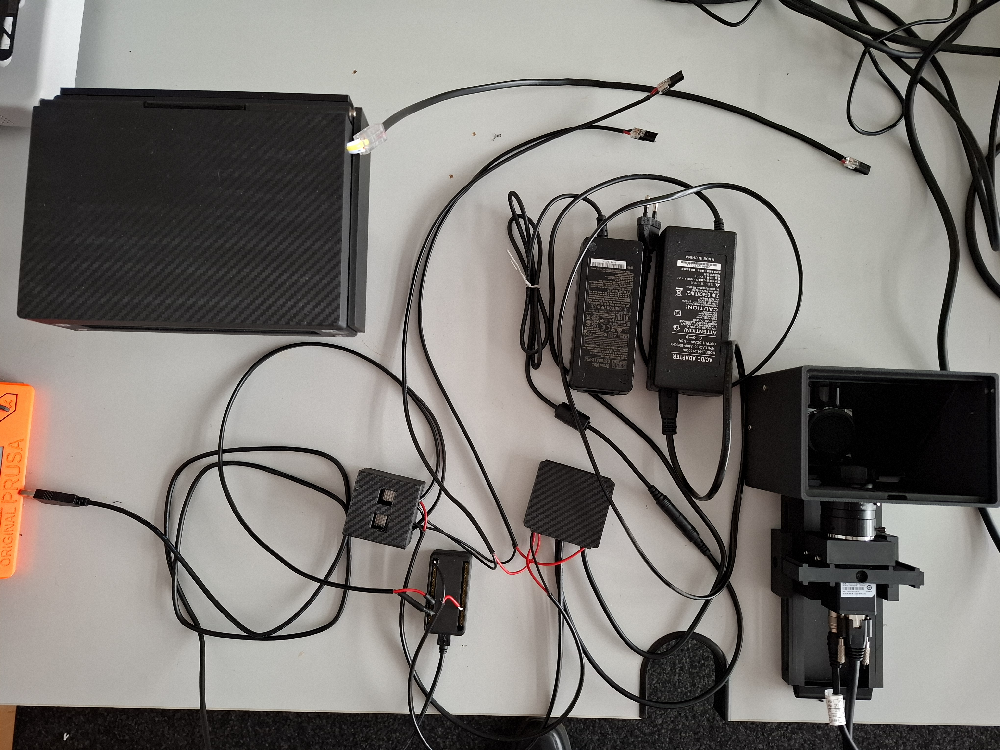
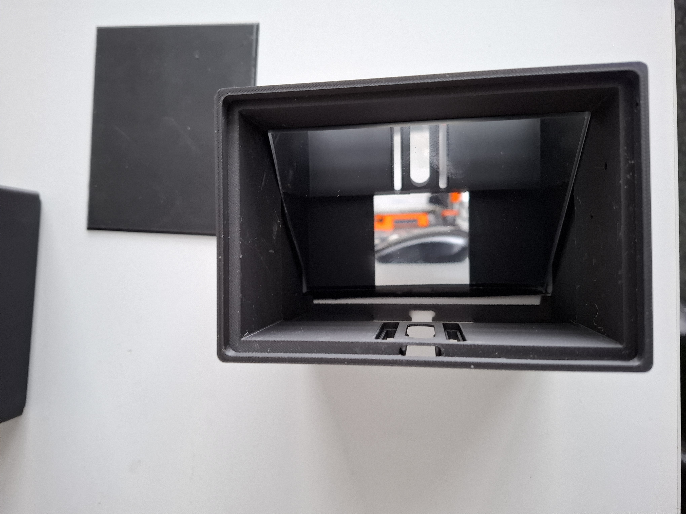
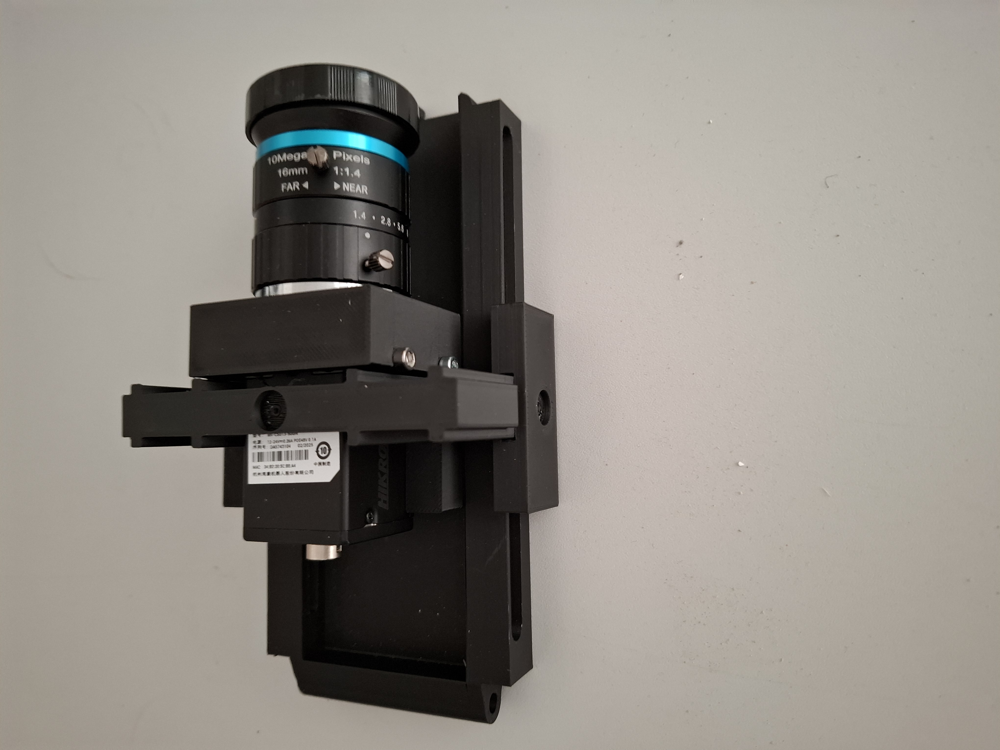
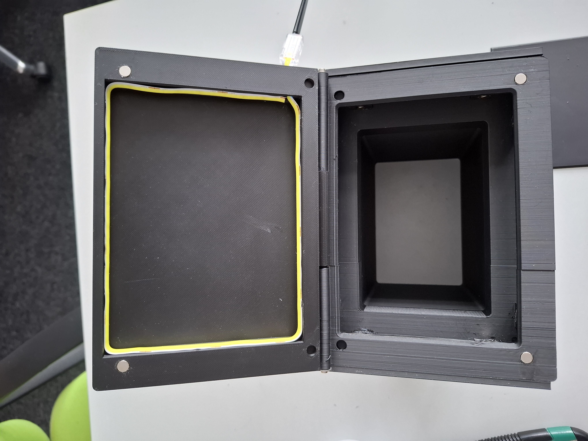

# Device Photos

This directory contains photos of the Nematostella timelapse recording hardware setup.

## Setup Photos

### Overview — All Components

{ width="70%" }

---

### Imager Body and Mirror

{ width="70%" }

---

### Camera Rail Guide

{ width="70%" }

---

### Sample Mount with White Light Lid

{ width="70%" }

---

### White Light Lid — Oblique Illumination

{ width="70%" }

---

## Build Progress Photos

