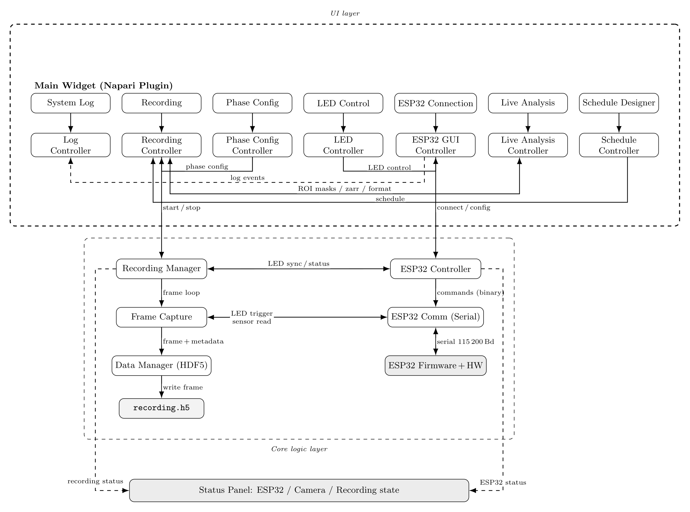
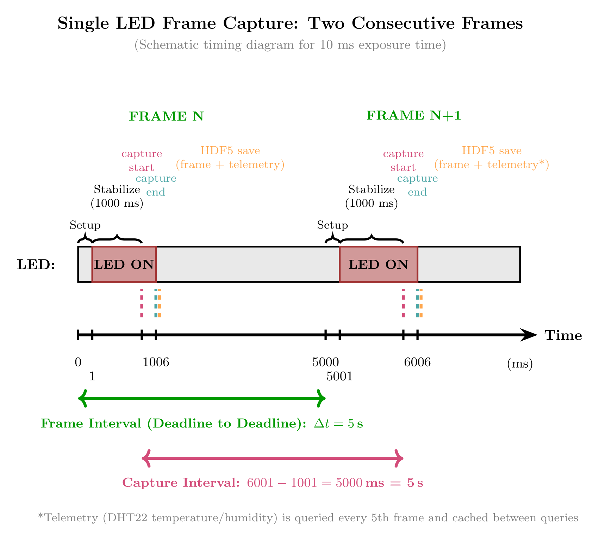
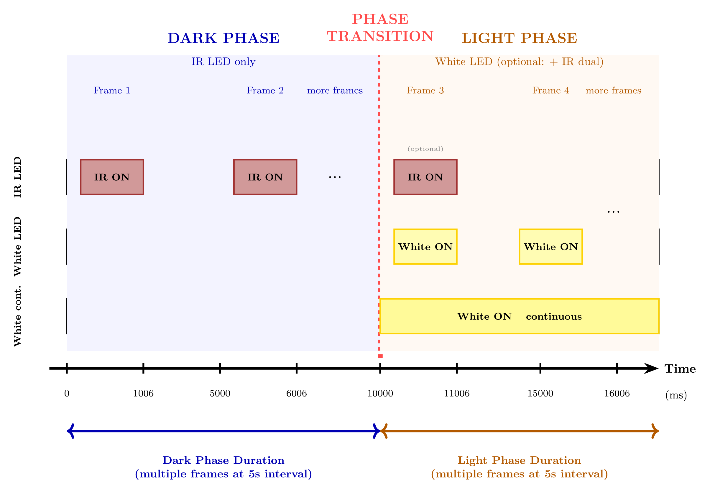
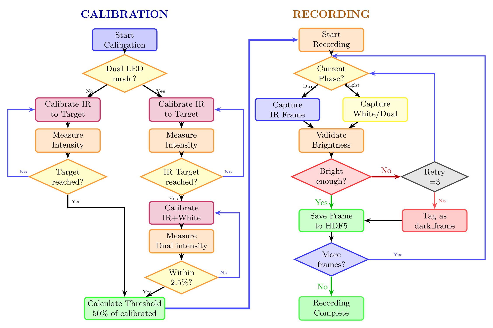

# Recording Plugin — Overview

[](https://pypi.org/project/nematostella-time-series)
[](https://napari-hub.org/plugins/nematostella-time-series)

**`nematostella-time-series`** is a [napari](https://napari.org) plugin for
synchronized timelapse recording of *Nematostella vectensis* with dual-LED
illumination (IR + White) and ESP32-based hardware synchronization.

## Key features

<div class="grid cards" markdown>

-   :material-sync:{ .lg .middle } &nbsp; **Hardware-synchronized LEDs**

    ---

    Camera exposure and LED illumination are synchronized via the ESP32 for
    precise, repeatable timing.

-   :material-lightbulb-on:{ .lg .middle } &nbsp; **Dual-LED illumination**

    ---

    Independent IR (850 nm, exchangeable) and White (broad-spectrum) channels
    for oblique lighting and light stimulation.

-   :material-theme-light-dark:{ .lg .middle } &nbsp; **Phase-based recording**

    ---

    Automated light/dark cycles for circadian rhythm studies.

-   :material-clock-outline:{ .lg .middle } &nbsp; **Drift-compensated timing**

    ---

    Frame timing measured from absolute recording start — no cumulative drift
    over multi-day runs.

-   :material-tune:{ .lg .middle } &nbsp; **LED calibration**

    ---

    Interactive calibration to normalize LED intensities across channels.

-   :material-database:{ .lg .middle } &nbsp; **Zarr & HDF5 storage**

    ---

    Chunked HDF5 with a write-behind queue (`AsyncHDF5Writer`), plus Zarr with
    concurrent read-while-write for live analysis.

</div>

Also included: real-time temperature/humidity monitoring (DHT22), a **Live
Analysis** tab (auto ROI detection via HoughCircles, per-ROI activity every 20 s;
needs `opencv-python`), a browser-based [firmware installer](installer.html),
and live frame display with recording statistics.

## How it works

The plugin is organized as a layered recording architecture: a napari **UI layer**
of widgets and controllers on top of a **core-logic layer** that drives frame
capture, ESP32 LED synchronization and HDF5/Zarr storage.



### Frame timing

Each frame follows a hardware-synchronized cycle. Inter-frame intervals are
referenced to the absolute recording start to avoid cumulative drift; the host
plugin keeps full timing control and drives the ESP32 as a remote LED switch.



For circadian protocols the plugin alternates IR-only dark phases and white-LED
light phases, each containing multiple frames at a configurable interval.



### Calibration & recording pipeline

Before recording, LED powers are calibrated to a common target intensity; during
recording each frame is brightness-validated as it is written to disk.



## Get started

1. **Install**

    ```bash
    pip install nematostella-time-series
    ```

    Development install:

    ```bash
    git clone https://github.com/s1alknau/Nematostella-time-series.git
    cd nematostella-time-series
    pip install -e .
    ```

    Requires Python ≥ 3.9 and napari ≥ 0.4.18. Optional: `zarr` (Zarr recording)
    and `opencv-python` (Live Analysis tab).

2. **Build the imager** — see [Hardware & Assembly](hardware.md), the
   [Hardware Photos](images/README.md) and the [3D-Printed Parts](3D_Druck/README.md).

3. **Flash the ESP32** — open the [Firmware Installer](installer.html) in
   Chrome/Edge (no toolchain required). The
   [ESP32-S3-BOX-3 (Alternative)](ESP32-S3-BOX-3_CONFIGURATION.md) board is also
   supported.

4. **Record** — launch napari and open *Plugins → Nematostella Timelapse
   Recording*.

!!! tip "Full assembly instructions"
    The complete, step-by-step hardware assembly guide lives in the
    [project README on GitHub](https://github.com/s1alknau/Nematostella-time-series#readme).
    The [Hardware & Assembly](hardware.md) page here summarizes the wiring and
    pinout you need most often.

## Next steps

- Analyze your recordings with the [Analysis Plugin](analysis/index.md).
- Review the light/dark [Circadian Protocol](circadian.md).
- See the [Changelog](changelog.md) for release history.
