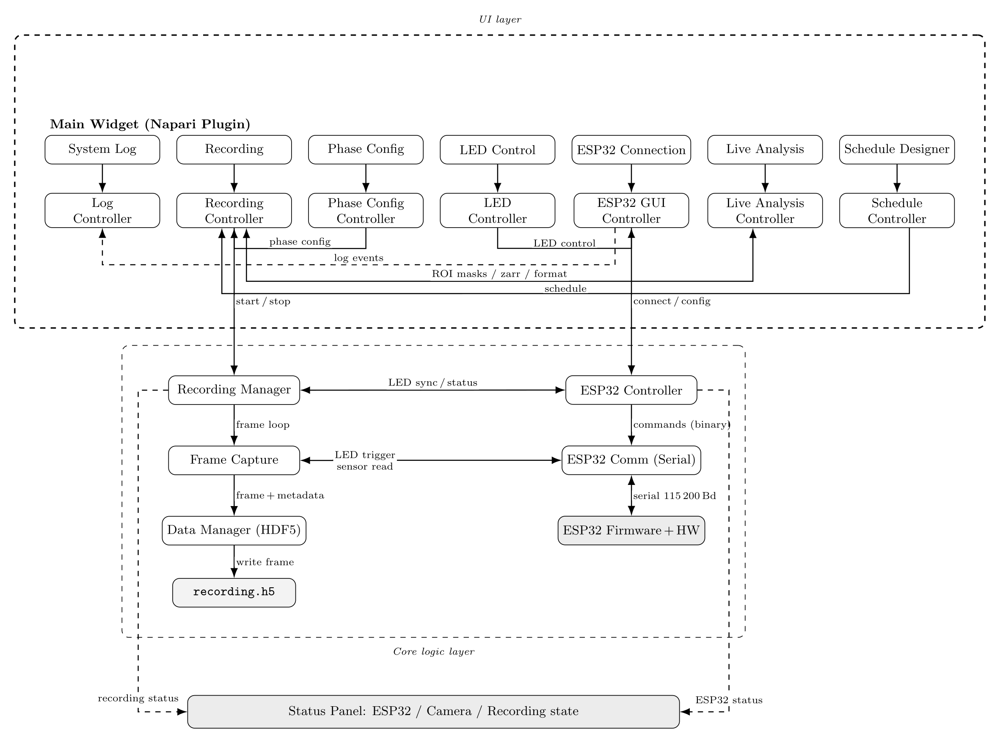
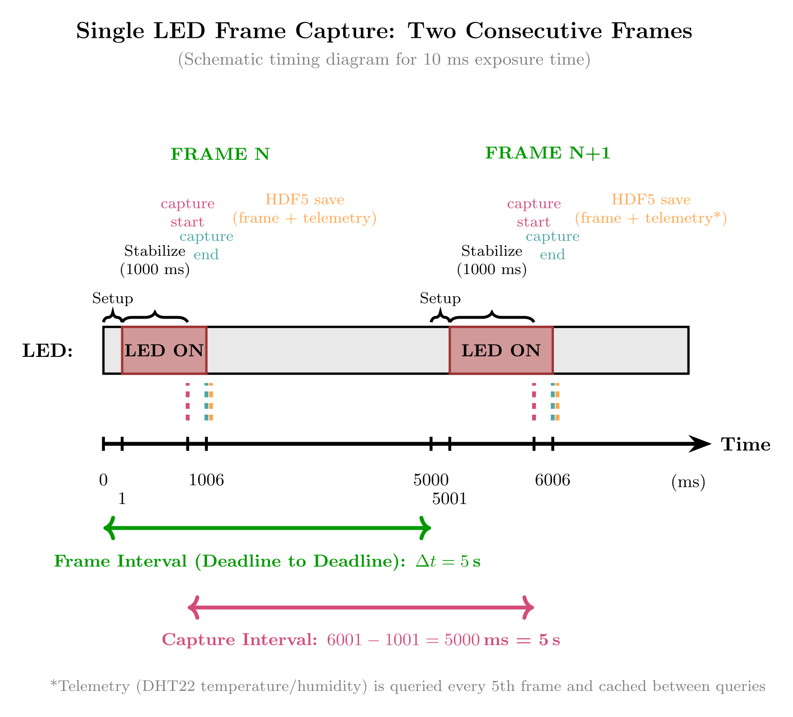
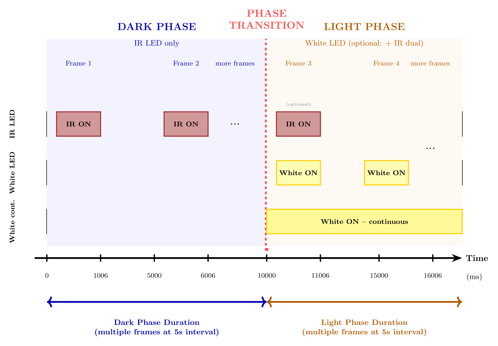
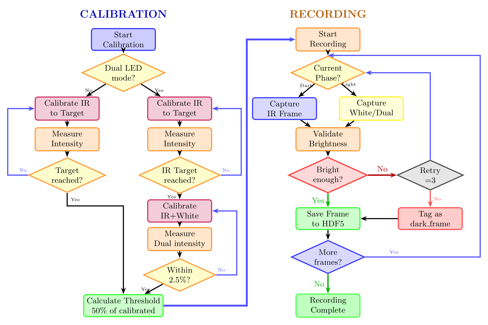

# Recording Plugin — Overview

[](https://pypi.org/project/nematostella-time-series)
[](https://napari-hub.org/plugins/nematostella-time-series)

**`nematostella-time-series`** is a [napari](https://napari.org) plugin for
synchronized timelapse recording of *Nematostella vectensis* with dual-LED
illumination (IR + White) and ESP32-based hardware synchronization.

## Key features

<div class="grid cards" markdown>

-   :material-sync:{ .lg .middle } &nbsp; **Hardware-synchronized LEDs**

    ---

    Camera exposure and LED illumination are synchronized via the ESP32 for
    precise, repeatable timing.

-   :material-lightbulb-on:{ .lg .middle } &nbsp; **Dual-LED illumination**

    ---

    Independent IR (850 nm, exchangeable) and White (broad-spectrum) channels
    for oblique lighting and light stimulation.

-   :material-theme-light-dark:{ .lg .middle } &nbsp; **Phase-based recording**

    ---

    Automated light/dark cycles for circadian rhythm studies.

-   :material-clock-outline:{ .lg .middle } &nbsp; **Drift-compensated timing**

    ---

    Frame timing measured from absolute recording start — no cumulative drift
    over multi-day runs.

-   :material-tune:{ .lg .middle } &nbsp; **LED calibration**

    ---

    Interactive calibration to normalize LED intensities across channels.

-   :material-database:{ .lg .middle } &nbsp; **Zarr & HDF5 storage**

    ---

    Chunked HDF5 with a write-behind queue (`AsyncHDF5Writer`), plus Zarr with
    concurrent read-while-write for live analysis.

</div>

Also included: real-time temperature/humidity monitoring (DHT22), a **Live
Analysis** tab (auto ROI detection via HoughCircles, per-ROI activity every 20 s;
needs `opencv-python`), a browser-based [firmware installer](installer.html),
and live frame display with recording statistics.

## How it works

The plugin is organized as a layered recording architecture: a napari **UI layer**
of widgets and controllers on top of a **core-logic layer** that drives frame
capture, ESP32 LED synchronization and HDF5/Zarr storage.



### Frame timing

Each frame follows a hardware-synchronized cycle. Inter-frame intervals are
referenced to the absolute recording start to avoid cumulative drift; the host
plugin keeps full timing control and drives the ESP32 as a remote LED switch.



For circadian protocols the plugin alternates IR-only dark phases and white-LED
light phases, each containing multiple frames at a configurable interval.



### Calibration & recording pipeline

Before recording, LED powers are calibrated to a common target intensity; during
recording each frame is brightness-validated as it is written to disk.



## Get started

The imager runs as one stack: **ImSwitch** drives the HIK GigE camera and pushes
the live image into napari, and this plugin reads its frames from that napari
layer while it controls the ESP32. ImSwitch, napari and the plugin therefore
have to be installed **into the same environment**, and all requirements have to
be in place *before* ImSwitch is started for the first time.

!!! tip "Full walkthrough"
    [Software Setup](software-setup.md) explains every step below in detail,
    including how to verify the camera, what each field of the setup JSON means,
    and a troubleshooting table.

1. **Create the `imswitch21` conda environment** — one environment for ImSwitch,
   napari and the plugin.

    ```bash
    conda create -n imswitch21 python=3.11 -y
    conda activate imswitch21
    ```

    Use this environment for every step below and for every later start.

2. **Install the Hik Robotics SDK** — the camera is driven by ImSwitch's
   `HikCamManager`, which binds to Hikrobot's **MVS SDK**. Install the MVS
   package from the
   [Hikrobot download center](https://www.hikrobotics.com/en/machinevision/service/download)
   *before* ImSwitch, then check in the MVS client that the camera is listed
   (camera and network adapter must be in the same subnet).

3. **Install ImSwitch** — use **our fork**, branch `nematostella-rig`. It is
   openUC2's ImSwitch 2.1.191 plus three commits this rig needs, and provides
   `HikCamManager` and the UC2 `ESP32Manager`. Upstream does not work: the Qt
   GUI aborts on startup, `fcntl` is missing on Windows, and `setLaserGalvo()`
   does not exist — see [Software Setup](software-setup.md#step-3-install-imswitch).

    ```bash
    git clone -b nematostella-rig https://github.com/s1alknau/ImSwitch.git
    cd ImSwitch
    pip install -e .
    pip install "PySide6==6.8.3" qtpy napari pyqtgraph qdarkstyle
    ```

    `pip install -e .` installs no GUI packages, so the second line is not
    optional: without `qtpy` ImSwitch aborts at startup with
    `ModuleNotFoundError: No module named 'qtpy'`. On the Qt 5 path,
    `pip install -e ".[PyQt5]"` covers the same set.

    Don't start ImSwitch yet — finish step 5 first. The configuration folder
    `~/ImSwitchConfig/` with its `imcontrol_setups/` subfolder is
    created on the first start; create it now (`mkdir -p
    ~/ImSwitchConfig/imcontrol_setups`) so the next step can already
    place the setup file.

4. **Add the camera setup file to `imcontrol_setups`** — copy
   [`Json+cam_manager/example_uc2_ddorf_hik_imager_IR.json`](https://github.com/s1alknau/Nematostella-time-series/blob/Nematostella-time-series-IR/Json%2Bcam_manager/example_uc2_ddorf_hik_imager_IR.json)
   into `~/ImSwitchConfig/imcontrol_setups/`, adjust `serialport`
   (ESP32 port) and `cameraListIndex`, then select it in ImSwitch as the active
   setup and restart.

5. **Install the plugin and its requirements** — still inside the activated
   `imswitch21` environment:

    The plugin is not on PyPI — install it from source:

    ```bash
    git clone https://github.com/s1alknau/Nematostella-time-series.git
    cd Nematostella-time-series
    pip install -e .
    ```

    Requires Python ≥ 3.10 and napari ≥ 0.4.19. Optional: `opencv-python` for
    the Live Analysis tab (`pip install -e ".[opencv]"`).

6. **Build the imager** — see [Hardware & Assembly](hardware.md), the
   [Hardware Photos](images/README.md) and the [3D-Printed Parts](3D_Druck/README.md).

7. **Flash the ESP32** — open the [Firmware Installer](installer.html) in
   Chrome/Edge (no toolchain required). The
   [ESP32-S3-BOX-3 (Alternative)](ESP32-S3-BOX-3_CONFIGURATION.md) board is also
   supported.

8. **Record** — start ImSwitch from the `imswitch21` environment, load the setup
   and start the live view:

    ```bash
    conda activate imswitch21
    imswitch
    ```

    Then open *Plugins → Nematostella Timelapse Recording* in the napari viewer
    and connect the ESP32 in the plugin's **ESP32 Connection** tab. Without a
    HIK camera, start a plain `napari` session instead.

!!! note "Without a HIK camera"
    The plugin also runs in a plain `napari` session — steps 2–4 are only needed
    for the ImSwitch/HIK GigE camera path.

!!! tip "Full assembly instructions"
    The complete, step-by-step hardware assembly guide lives in the
    [project README on GitHub](https://github.com/s1alknau/Nematostella-time-series#readme).
    The [Hardware & Assembly](hardware.md) page here summarizes the wiring and
    pinout you need most often.

## Next steps

- Follow the detailed [Software Setup](software-setup.md) if anything above fails.
- Analyze your recordings with the [Analysis Plugin](analysis/index.md).
- Review the light/dark [Circadian Protocol](circadian.md).
- See the [Changelog](changelog.md) for release history.
